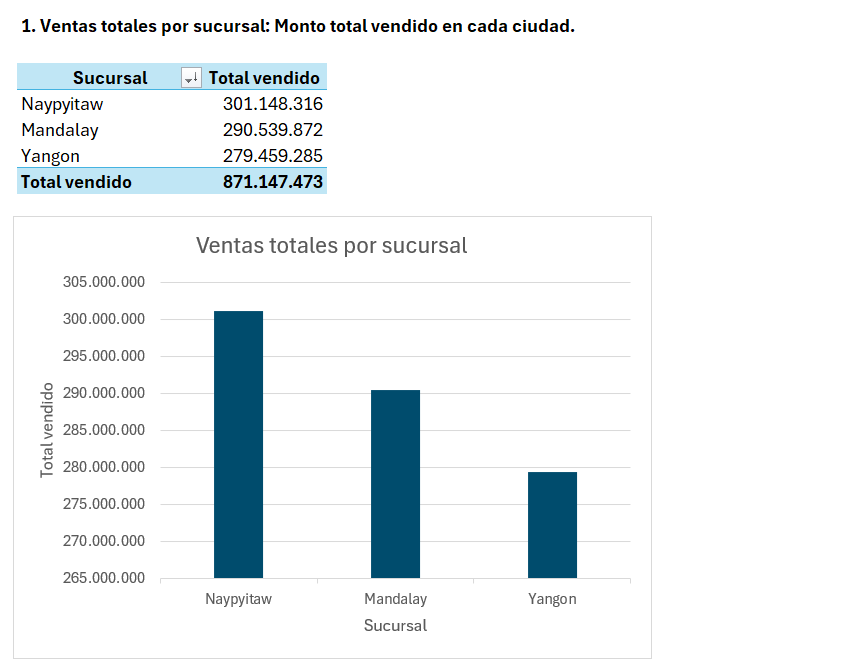
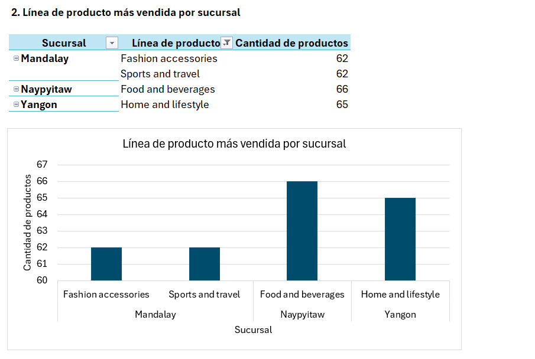
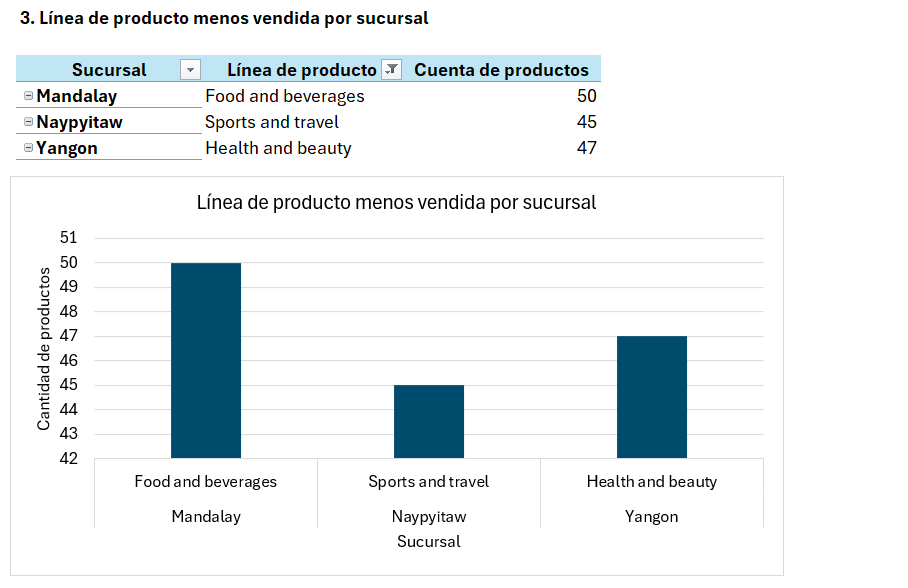
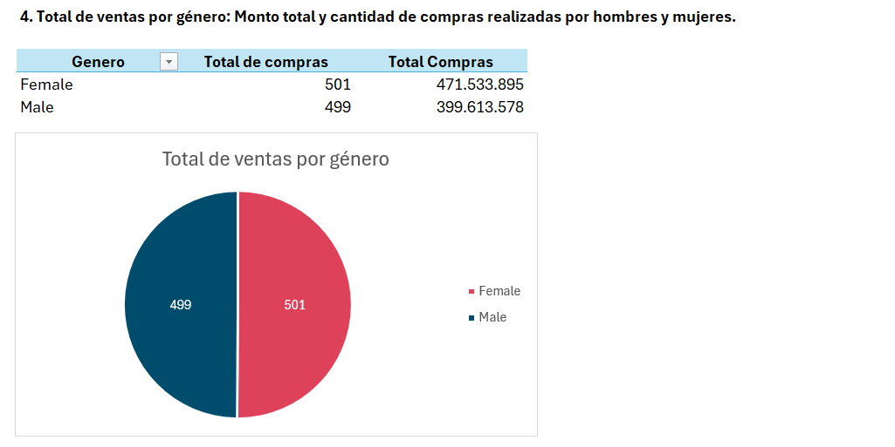
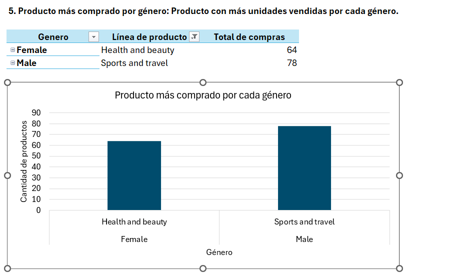
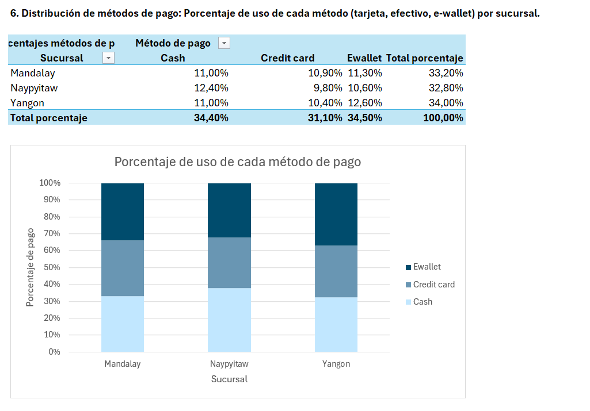
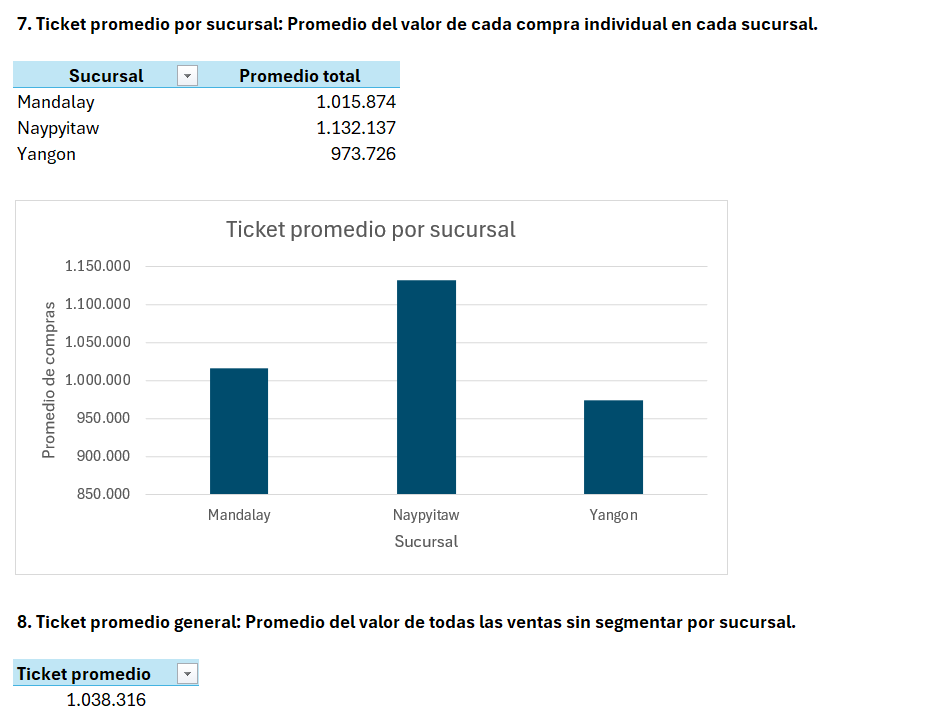
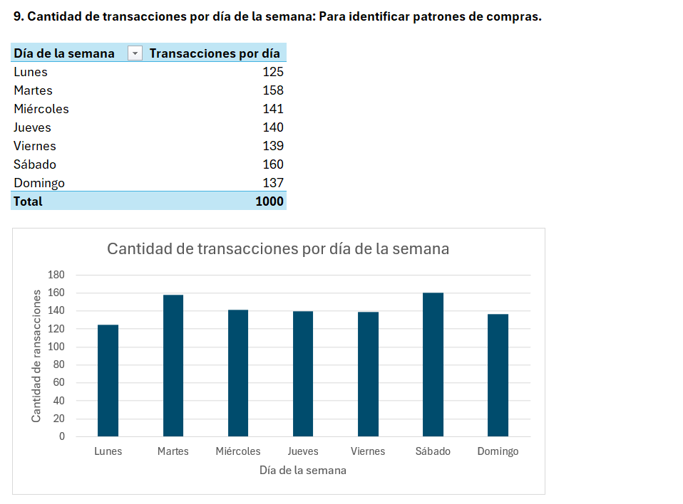
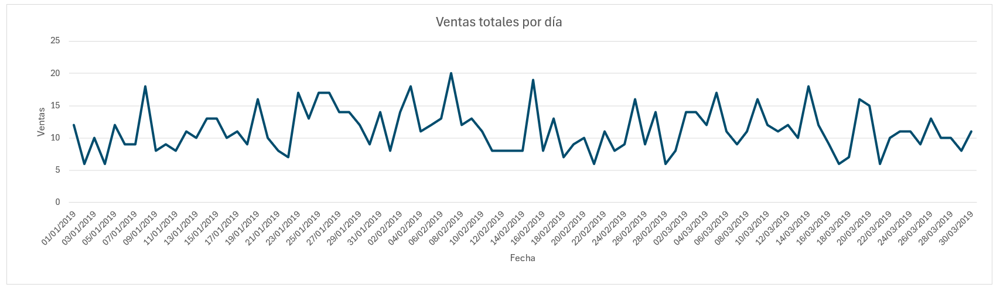

# 📊 Análisis de ventas por sucursales de supermercados en Myanmar 

## 🎯 Objetivo
Analizar las ventas realizadas en tres sucursales de supermercado en Myanmar durante el primer trimestre de 2019, con el fin de identificar los productos más vendidos, los patrones de compra por tipo de cliente y los métodos de pago más utilizados.

## 🗃️ Dataset
- **Nombre**: Supermarket sales dataset
- **Fuente**: Github
- **Descripción**: Base de datos de ventas de un supermercado para practicas de KPI's y visualización de datos.
- **Enlace**:  https://gist.github.com/sdukshis/7c2bb5e650ac567eefb7c939c4c4c8ff#file-sales-csv

## 🧰 Herramientas y tecnologías utilizadas
- Microsoft Excel
- GitHub

## 📈 Análisis y resultados
- La sucursal con más ventas es Naypyitaw y la categoría de producto más vendida es la de comida y bebidas.
- La sucursal con menos ventas es Yagon y la categoría menos vendida es la de salud y belleza.
- Los hombres realizarón más compras en general. La categoría con mayor número de compras por parte de los hombres es la de deportes y viajes, mientras que la de las muejres es salud y belleza.
- El método de pago más utiliza es Ewallet.
- El promedio de ventas es de 1.038.316. Sin embargo, la sucursal Naypyitaw tiene un promedio de ventas superior (1.132.136), siendo esta sucursal la que tiene el  mayor promedio de ventas.
- El día sábado es el día de la semana que más se realizan transacciones en las 3 sucursales.
- El día con más ventas realizadas fue el 7 de febrero con un total de 20, mientras que la menor cantidad de ventas fueron 6 y se registraron en 6 días diferentes (02/01/2019, 04/01/2019, 21/02/2019, 28/02/2019, 17/03/2019 y 21/03/2019).

## 📸 Visualizaciones

Ventas totales por sucursal

Línea de producto más vendida por sucursal

Línea de producto menos vendida por sucursal

Total de ventas por género

Producto más comprado por cada género

Distribución de métodos de pago

Ticket promedio por cada sucursal

Transacciones por cada día de la semana

Ventas totales por día (gráfico)

## 📂 Estructura del proyecto
/01-fundamentos-analisis-excel/
│
├── data/
│   └── ventas_supermercado.csv
│
├── documentos/
│   └── planeacion.md
│   └── resumen_fundamentos.md
│
├── entregable/
│   └── proyecto_excel.xlsx
│   └── capturas_graficos.png
│
├── README.md

## 🧹 Limpieza realizada:
- Formato de fecha uniforme (DD-MM-YYYY)
- Conversión de hora a formato 24h y categorización por franja horaria
- Normalización de texto en columnas categóricas (Branch, Payment, etc.)
- Eliminación de duplicados en Invoice ID
- Revisión de tipos de datos y valores vacíos
- Eliminación de columnas innecesarias

## 🧪 Lecciones aprendidas
Como reflexión personal aprendí que se debe ser cuidado con el formato de las fechas, ya que aparentemente dos fechas pueden tener el mismo formato pero no por eso estan bien gestionadas. 

## 🔗 Enlaces adicionales
- Repositorio en Notion: 
